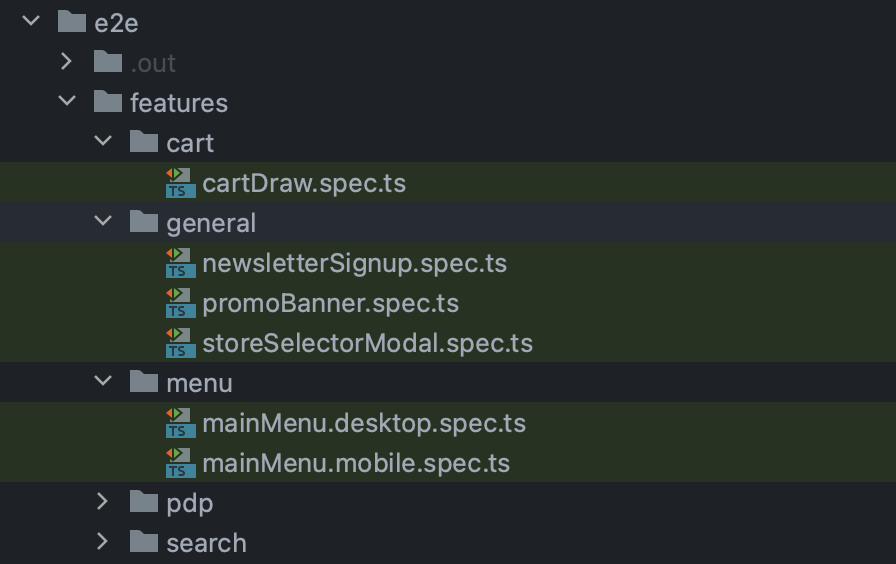

# E2E testing with Playwright

Playwright is a testing framework that lets you automate Chromium, Firefox, and WebKit with a single API. You can use it to write **End-to-End (E2E)** and **Integration** tests across all platforms.

We utilise the framework to run **Intergration** tests across our code bases allowing us to programatically tests all **features**.

Playwright docs can be found at\
[https://playwright.dev/](https://playwright.dev/)\


## Test Structure

Our Playwright test coverage can be found in under the `storefront-app` in the `e2e/features` folder.



These tests are divided into logically named groupings based on page type and function. For instance, `pdp` or `search`

Test files themselves follow the naming convention `testname.spec.ts` with additional values added to specify if the test should **only** be run on a Desktop or Mobile simulation. eg. `testname.dekstop.spec.ts` or `testsname.mobile.spec.ts`

## Test file structure

Our tests files are strctured to around two key concepts, beyond what you will read in playwright's own documentation.&#x20;

### Gherkin syntax (Behaviour Driven Development)

When we create development tasks for headless projects it's really important that clients, managers, developers and designers are in agreement on just **what** something is supposed to do

To this end, the use of Gherkin syntax is promoted. But this syntax isn't just useful for writing tasks, its also great for verifying them because each 'step' in Gherkin can be treated as a testable action.

So each test, much like a feature definition stats with a **description**

```typescript
test.describe('Feature: Newsletter Sign up', () => {
```

Inside that we have the individual scenario we wish to test

```typescript
test('Scenario: Newsletter Sign up', async ({ page, port }) => {
```

This uses the Playwright function `test` to establish that this is indeed a test and generally passes us at least two important parameters.&#x20;

The first is `page` which is the browser page we will now be controlling.\
The second is `port` which we will use as part of any URL as this will be the port that our test instance will be run against. eg ``await page.goto(`http://localhost:${port}/`);``

To make the next part easier we have created a helper function called, `testStep` this allows us to write step definitions just as we would for Gherkin; Given, When, Then.

```typescript
await testStep(
  {
    type: 'Given',
    description: 'I am a customer viewing the footer',
  },
  async () => {
    await page.goto(`http://localhost:${port}/`);
    await page.locator(newsletterSignupSelector).scrollIntoViewIfNeeded();
  }
);
```

This allows us to quickly compose and read the same steps we built against into a machine-driven test.

### Stubbing and Request Interceptors

Sometimes we will be working with a page that requires access to data. A PDP for example.

For testing, we cannot rely on data from Shopify (or any other data source) because our tests need to be immutable, not subject to a user being able to change the data source.

So to achieve this we use stubbing, we stand between our app and the data source and when a request is made we 'fake\` a response. These fakes are handled by a system called Mock Service Worker and happen effective at a network level, the application has no idea its data has been 'faked' and so the results we see from our tests are true.

To perform stub data as part of the request we must make use of two additional parameters from the test function.


```
serverRequestInterceptor
```



```
clientRequestInterceptor
```


Each function accepts an array of MSW[ request handlers ](https://mswjs.io/docs/basics/request-handler)these functions allow us to stub rest or graphql requests in an easy-to-use syntax. For example.&#x20;


```typescript
const requestHandlers: RequestHandler[] = [
  graphql.query('GetColorSystems', (req, res, ctx) => {
    return res(ctx.data(GetColorSystems));
  }),
  graphql.query('GetProduct', (req, res, ctx) => {
    return res(ctx.data(GetProduct));
  }),
];
serverRequestInterceptor.use(...requestHandlers);
await clientRequestInterceptor.use(...requestHandlers);

await page.goto(`http://localhost:${port}/products/color-picker-test`);
```


In this example we stub two graphql data sources allowing for the page navigated too to make use of both on the server side for getStaticProps and and any subseiquent navigations.
